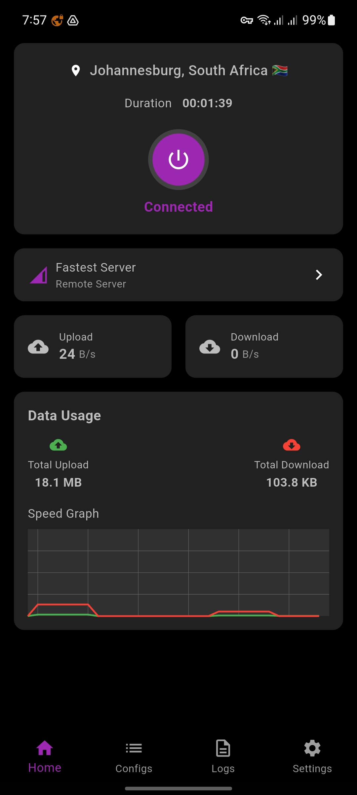
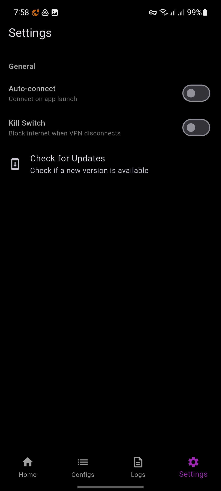
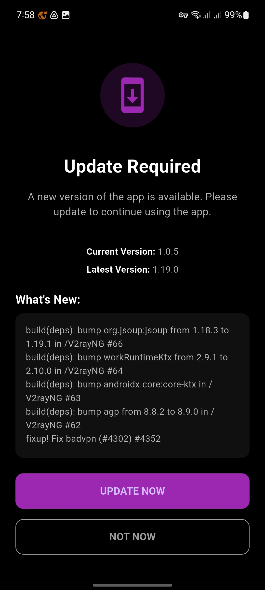
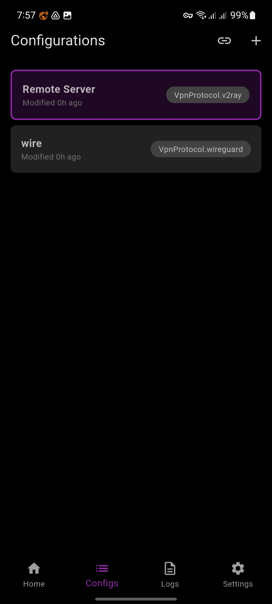
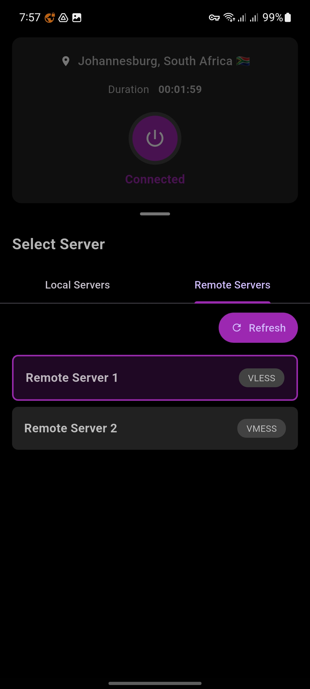
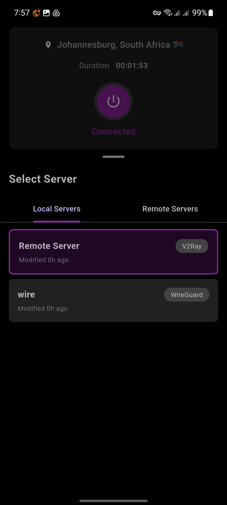
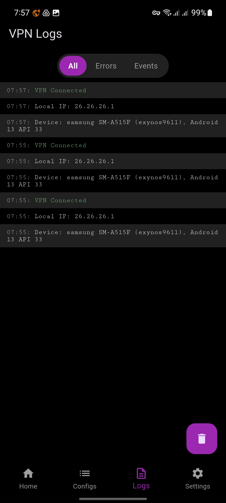

---# Ann VPN - Advanced VPN Solution

Ann VPN is a powerful, lightweight VPN client for Android that offers secure internet access through multiple protocols including V2ray and WireGuard.

## Features

- **Multiple VPN Protocols**: Supports V2ray and WireGuard protocols
- **Free V2ray Servers**: Access a selection of free V2ray servers for enhanced security and performance.
- **Kill Switch**: Blocks internet when VPN disconnects for enhanced security
- **Connection Statistics**: Real-time monitoring of upload/download speeds and data usage
- **Auto-connect**: Option to automatically connect on app launch
- **Server Selection**: Choose from configured servers or use the fastest server option
- **Configuration Management**: Add and modify VPN server configurations

## Screenshots

| Settings | Update Screen | Configurations | Connected |
|---------|--------------|---------------|-----------|
|  |  |  |  |

### Additional App Views

| Server Selection | Local Servers | Connection Logs |
|-----------------|--------------|-----------------|
|  |  |  |

## Video Demonstration

## Getting Started

1.  **Download and install the app:** [Download Ann VPN](https://workupload.com/file/4FMe4FYnG7S)
2.  **Free V2ray Servers**: The app provides access to free V2ray servers.
3.  Add a VPN configuration (Remote Server or WireGuard)
4.  Connect to your preferred server
5.  Enjoy secure and private browsing

## Configuration Options

The app supports two main types of configurations:
- **V2ray Protocol**: For V2ray servers with advanced routing capabilities
- **WireGuard Protocol**: For WireGuard servers offering simple yet secure connections

## Settings

- **Auto-connect**: Automatically connect when the app launches
- **Kill Switch**: Block internet access when VPN disconnects
- **Updates**: Check for new versions of the app

## Data Usage

The app tracks:
- Current upload/download speeds
- Total data usage (uploaded and downloaded)
- Connection duration
- Speed graph for performance monitoring

## Security Features

- **Kill Switch**: Prevents IP/data leaks if the VPN connection drops
- **Protocol Options**: Choose the protocol that fits your security needs
- **Server Selection**: Connect to servers in various global locations

## Requirements

- Android 6.0 or later
- Internet connection
- 20MB+ free storage space

## Troubleshooting

If you experience any issues:
1. Check your internet connection
2. Update to the latest version of the app
3. Try a different server configuration
4. Check the logs section for error details

## Privacy

This app helps protect your privacy by:
- Encrypting your internet traffic
- Masking your real IP address
- Preventing tracking from your ISP

---

